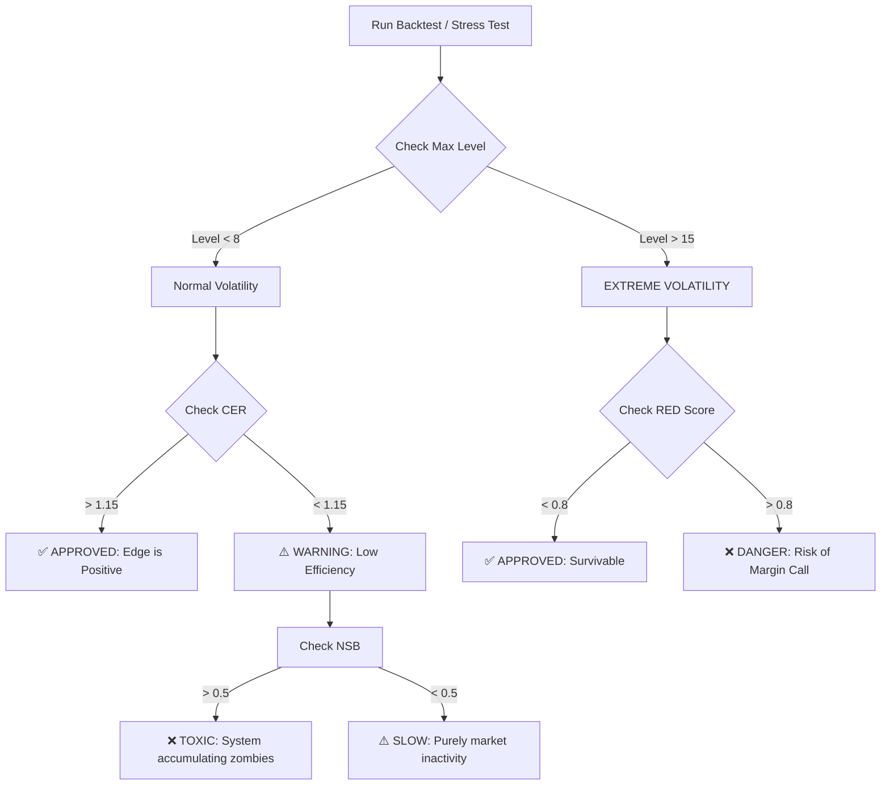

# WSPlumber: Robustness Interpretation Guide (V4.1)

This guide helps you interpret the results of the **Advanced Robustness Suite** (RED, CER, and NSB) and the **Monte Carlo Certificates**.

## 1. Metric Reference Table

Use this table as a quick reference for backtest results:

| Metric | Ideal (Green) | Warning (Yellow) | Critical (Red) | Logic |
| :--- | :--- | :--- | :--- | :--- |
| **RED Score** | **< 0.3** | **0.3 - 0.7** | **> 0.8** | **Margin Safety**: Higher means you are closer to a Margin Call. |
| **CER Ratio** | **> 1.30** | **1.15 - 1.25** | **< 1.10** | **Mathematical Edge**: Must be higher than broker cost (1.0). |
| **NSB Bias** | **< 0.2** | **0.2 - 0.5** | **> 0.5** | **Debt Toxicity**: High values mean "bad" cycles are never closing. |

---

## 2. In-Depth Metric Interpretation

### A. RED Score (Recovery Exhaustion Depth)
*   **What it measures**: The system's "defense capacity." If your capacity is level 20 and you hit level 10, your RED Score is 0.5.
*   **Interpretation**:
    *   **0.1 - 0.4**: Very safe. The system has plenty of room to handle larger market moves.
    *   **0.5 - 0.7**: Normal stress. The recovery cascade is working as intended, but monitoring is advised.
    *   **> 0.8**: **Risk of Blowout**. The market move is exceeding the system's planned recovery tiers.

### B. CER (Cycle Efficiency Ratio)
*   **What it measures**: Efficiency. For every pip of debt we incur, how many pips of profit do we realize?
*   **Interpretation**:
    *   **> 1.50**: Exceptional. The edge is dominating the market randomness.
    *   **1.15 - 1.30**: Sustainable. This is the "sweet spot" where the system pays for its own spread and slippage.
    *   **< 1.00**: **Losing Edge**. You are generating debt faster than you can recover it. The "house" (broker) is winning.

### C. NSB (Negative Selection Bias)
*   **What it measures**: Tracking of "Zombie" cycles. Does the system tend to keep losers open for too long?
*   **Interpretation**:
    *   **Near 0.0**: Healthy. Cycle age is not correlated with debt.
    *   **Positive (0.6+)**: **Debt Accumulation**. Old cycles are dragging down the account while new "easy" TP cycles close fast. This indicates "Selection Bias."

---

## 3. Decision Logic Flowchart

## 4. How to Read the "Robustness Certificate"

When you see a certificate like `robustness_cert_stress_50k.md`, look for the **Resolution Entropy**:
- **100%**: The system resolved every single "random walk" cycle. This is the **Gold Standard**.
- **95% - 99%**: Some cycles are still open. Acceptable if RED score is low.
- **< 90%**: The system is struggling to fight the randomness. Check your `RECOVERY_DISTANCE_PIPS`.

---
> [!IMPORTANT]
> A backtest with **CER < 1.0** on real data means the system is structurally unprofitable regardless of how "safe" the RED score looks.
