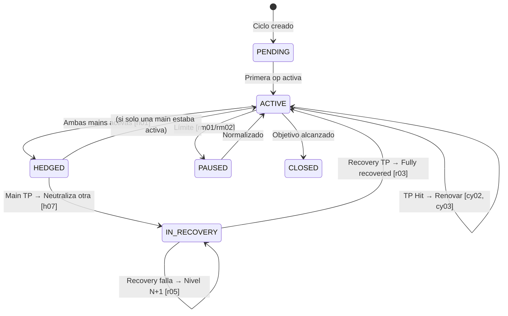
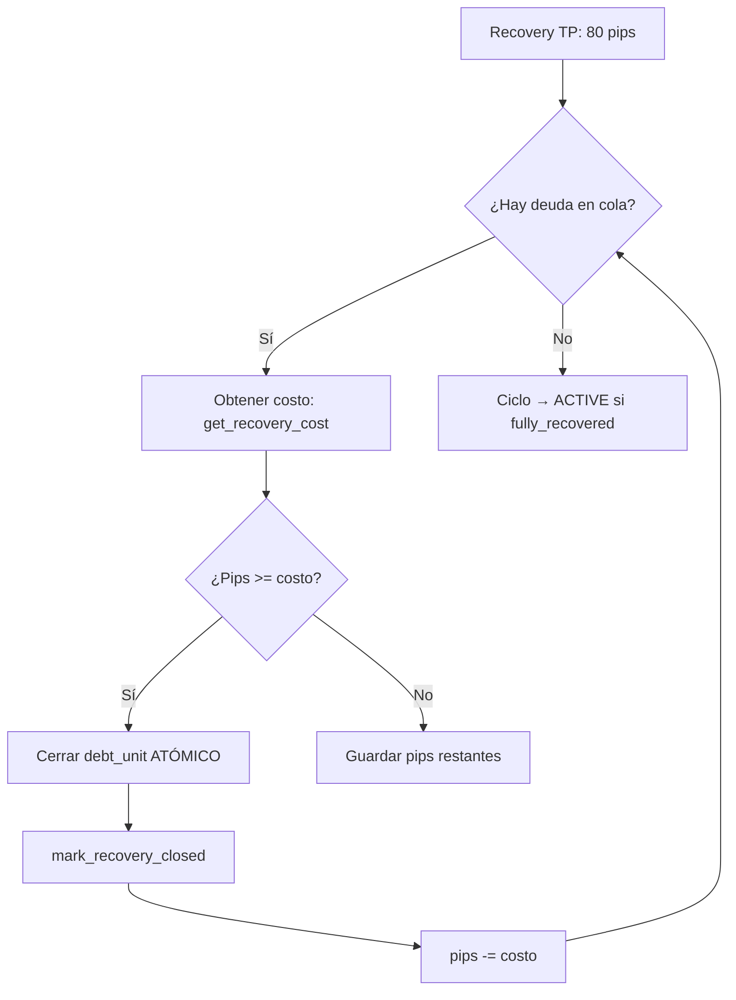

# Estrategia de Testing

## Filosofía

El sistema de testing usa **datos sintéticos en CSV** para simular escenarios de mercado sin depender de MT5. Cada CSV representa un "caso de prueba" que documenta el comportamiento esperado del sistema.

> [!IMPORTANT]
> **Arquitectura SIN Stop Loss (SL):** Este sistema usa **hedges** y **recoveries** en lugar de SL tradicionales. Cuando ambas operaciones main (BUY + SELL) se activan, entran en estado HEDGED y se neutralizan mutuamente.

---

## Matriz Completa de Escenarios

> **Referencia:** Ver [scenarios.md](scenarios.md) para el índice completo de 62 escenarios.

### Nivel 1: Core (Operaciones Individuales)

| ID  | Escenario                     | Acción Esperada                    | Prioridad |
| --- | ----------------------------- | ---------------------------------- | --------- |
| c01_tp_simple_buy | Precio sube 10 pips | TP ejecutado, beneficio registrado | 🔴 Crítico |
| c01_tp_simple_sell | Precio baja 10 pips | TP ejecutado, beneficio registrado | 🔴 Crítico |
| c03_activation_no_tp | Precio oscila sin tocar TP | Operación permanece abierta | 🟡 Alto |
| c04_no_activation | Precio no activa orden | Operación permanece PENDING | 🟡 Alto |
| c05_gap_tp | Gap de precio atraviesa TP | TP ejecutado al precio de gap | 🔴 Crítico |

### Nivel 2: Ciclos

| ID   | Escenario                    | Acción Esperada                  | Prioridad |
| ---- | ---------------------------- | -------------------------------- | --------- |
| cy01_new_cycle | Nuevo ciclo se abre | Operación MAIN_BUY + MAIN_SELL creadas | 🔴 Crítico |
| cy02_tp_in_cycle | TP alcanzado en ciclo activo | Ciclo permanece activo, nueva op | 🔴 Crítico |
| cy03_tp_renews_operations | TP renueva operaciones | FIX-001: Crea nuevas BUY+SELL | 🔴 Crítico |
| cy04_cancel_counter_main | TP cancela main contraria | Cuando una toca TP, la pendiente se cancela | 🔴 Crítico |
| cy05_complete_10_tps | Ciclo completa 10 TPs | Ciclo exitoso completo | 🟡 Alto |

### Nivel 3: Hedged (Cobertura)

| ID  | Escenario                      | Acción Esperada                    | Prioridad |
| --- | ------------------------------ | ---------------------------------- | --------- |
| h01_both_active_hedged | Ambas main activas | Estado → HEDGED | 🔴 Crítico |
| h02_create_hedge_operations | Crear hedges | HEDGE_BUY + HEDGE_SELL creados | 🔴 Crítico |
| h03_neutralize_mains | Neutralizar mains | Status → NEUTRALIZED | 🔴 Crítico |
| h04_lock_20_pips | Bloquear pips | pips_locked = 20 | 🔴 Crítico |
| h07_buy_tp_hedge_sell | BUY TP en HEDGED | FIX-002: Cancela HEDGE_SELL pendiente | 🔴 Crítico |

### Nivel 4: Recovery

| ID  | Escenario                      | Acción Esperada                    | Prioridad |
| --- | ------------------------------ | ---------------------------------- | --------- |
| r01_open_from_tp | Recovery desde TP | Operación Recovery abierta desde precio TP | 🔴 Crítico |
| r02_recovery_distance_20 | Recovery a 20 pips | Entry a ±20 pips del TP | 🔴 Crítico |
| r03_recovery_n1_tp | Recovery N1 alcanza TP | Pips bloqueados se recuperan (80 pips) | 🔴 Crítico |
| r05_recovery_n1_fails_n2 | Recovery N1 no alcanza TP | Recovery N2 se activa a +40 pips | 🔴 Crítico |
| r06_recovery_n2_success | Recovery N2 éxito | Pips N1 + N2 recuperados | 🟡 Alto |
| r08_recovery_max_n6 | Recovery llega a N6 (máximo) | Sistema alerta max_recovery_level | 🟡 Alto |

### Nivel 5: FIFO (Cierre de Deudas)

| ID  | Escenario                      | Acción Esperada                    | Prioridad |
| --- | ------------------------------ | ---------------------------------- | --------- |
| f01_fifo_first_costs_20 | Primer recovery 20 pips | FIX-003: Incluye main+hedge | 🔴 Crítico |
| f02_fifo_subsequent_40 | Siguientes 40 pips | Recovery adicionales cuestan 40 | 🔴 Crítico |
| f03_fifo_atomic_close | Cierre atómico | Main + Hedge cierran juntos | 🟡 Alta |
| f04_fifo_multiple_close | FIFO múltiple | 80 pips cierran varios | 🟡 Alta |

### Nivel 6: Risk Management

| ID   | Escenario                      | Acción Esperada            | Prioridad |
| ---- | ------------------------------ | -------------------------- | --------- |
| rm01_exposure_limit | Exposición alcanza límite | Nuevos ciclos bloqueados | 🔴 Crítico |
| rm02_drawdown_limit | Drawdown alcanza límite | Sistema pausa operaciones | 🔴 Crítico |
| rm03_daily_loss_limit | Pérdida diaria alcanza límite | Sistema pausa hasta mañana | 🟡 Alto |
| rm04_margin_insufficient | Margen insuficiente | Operación rechazada | 🟡 Alto |

### Nivel 7: Money Management

| ID   | Escenario                      | Acción Esperada                            | Prioridad |
| ---- | ------------------------------ | ------------------------------------------ | --------- |
| mm01_balance_read | Balance inicial correcto | Sistema lee balance de broker | 🔴 Crítico |
| mm02_pnl_tp | P&L de TP calculado | +10 pips × lot × valor_pip = € | 🔴 Crítico |
| mm03_pnl_hedged | P&L bloqueado en HEDGED | Pips neutralizados registrados | 🔴 Crítico |
| mm04_balance_update_tp | Balance actualiza tras TP | balance += P&L | 🔴 Crítico |
| mm05_equity_calculation | Equity | equity = balance + floating | 🔴 Crítico |
| mm06_margin_calculation | Margen | margin = lot × contract / leverage | 🟡 Alto |
| mm07_free_margin | Margen libre | free_margin = equity - margin | 🟡 Alto |
| mm08_recovery_pnl | P&L en Recovery | Suma total de recovery | 🟡 Alto |

---

## Detalle de Escenarios Clave

### c01_tp_simple_buy: TP Hit (Precio sube 10 pips)

```
INICIO:
  - Ciclo: ACTIVE
  - Operaciones: 1 MAIN_BUY (@ 1.10000, TP=1.10100) + 1 MAIN_SELL pendiente

TICK: 1.10100 (alcanza TP)

RESULTADO ESPERADO:
  ✓ MAIN_BUY cierra con status=TP_HIT
  ✓ MAIN_BUY pnl = +10 pips
  ✓ MAIN_SELL (pendiente) se CANCELA
  ✓ Ciclo permanece ACTIVE
  ✓ Nuevas MAIN_BUY + MAIN_SELL se abren (FIX-001)
```

### h01_both_active_hedged: Ambas Mains Activas → HEDGED

```
INICIO:
  - Ciclo: ACTIVE
  - MAIN_BUY: entry=1.10020 (PENDING)
  - MAIN_SELL: entry=1.09980 (PENDING)

SECUENCIA:
  1. TICK: 1.10020 → MAIN_BUY se ACTIVA
  2. TICK: 1.09980 → MAIN_SELL se ACTIVA

RESULTADO ESPERADO:
  ✓ Ciclo cambia a HEDGED
  ✓ pips_locked = 20 (separación 4 + TP 10 + margen 6)
  ✓ HEDGE_BUY + HEDGE_SELL se crean (pendientes)
  ✓ MAIN_BUY y MAIN_SELL → NEUTRALIZED
```

### r03_recovery_n1_tp: Recovery N1 Exitosa

```
INICIO:
  - Ciclo: IN_RECOVERY
  - pips_locked: 20
  - Recovery N1 BUY @ entry + 20 pips, TP = +80 pips

TICK: Recovery alcanza TP

RESULTADO ESPERADO:
  ✓ Recovery cierra con status=TP_HIT
  ✓ Recovery pnl = +80 pips
  ✓ FIFO procesa:
    - 20 pips para cerrar Main+Hedge (primer recovery cuesta 20)
    - 60 pips de beneficio neto
  ✓ Ciclo vuelve a ACTIVE
  ✓ Nuevas MAIN_BUY + MAIN_SELL se abren
```

### f03_fifo_atomic_close: Cierre Atómico (FIX-003)

```
INICIO:
  - MAIN_SELL: NEUTRALIZED @ 1.09980
  - HEDGE_BUY: ACTIVE @ 1.10020 (cubre main)
  - Recovery TP disponible: 80 pips

RESULTADO ESPERADO:
  ✓ Main + Hedge cierran en mismo timestamp (±1ms)
  ✓ debt_unit_id compartido
  ✓ close_method: "atomic_with_hedge" / "atomic_with_main"
  ✓ Ambas operaciones: status=CLOSED
```

---

## Mapeo de Escenarios a Código

### Flujo Principal

| Punto          | Archivo | Función | Línea |
| -------------- | ------- | ------- | ----- |
| Procesar tick | cycle_orchestrator.py | `process_tick` | 98 |
| Detectar TP | cycle_orchestrator.py | `_check_operations_status` | 218 |
| Renovar mains (FIX-001) | cycle_orchestrator.py | `_renew_main_operations` | 296 |
| Cancelar hedge (FIX-002) | cycle_orchestrator.py | `_cancel_pending_hedge_counterpart` | 387 |
| FIFO atómico (FIX-003) | cycle_orchestrator.py | `_close_debt_unit_atomic` | 625 |

### Recovery

| Punto | Archivo | Función | Línea |
| ----- | ------- | ------- | ----- |
| Recovery TP | cycle_orchestrator.py | `_handle_recovery_tp` | 495 |
| FIFO costo | cycle.py | `get_recovery_cost` | 71 |
| Marcar cerrado | cycle.py | `mark_recovery_closed` | 96 |

---

## Formato CSV Estándar

```csv
timestamp,pair,bid,ask,expected_event,expected_state
2024-01-01 10:00:00.000,EURUSD,1.10000,1.10020,CYCLE_OPEN,ACTIVE
2024-01-01 10:00:01.000,EURUSD,1.10005,1.10025,,
2024-01-01 10:00:02.000,EURUSD,1.10100,1.10120,TP_HIT,ACTIVE
2024-01-01 10:00:03.000,EURUSD,1.10105,1.10125,OP_RENEWED,ACTIVE
```

Columnas:
- `timestamp`: Momento del tick (milisegundos)
- `pair`: Par de divisas
- `bid`, `ask`: Precios
- `expected_event`: Evento que DEBE ocurrir
- `expected_state`: Estado del ciclo después del tick

---

## Grafo de Estados del Sistema

### Estado del Ciclo (Cycle State Machine)



### Flujo FIFO (FIX-003)



---

## Cobertura Mínima para Release

| Nivel     | Tests Requeridos | Estado |
| --------- | ---------------- | ------ |
| Core      | c01, c03-c05 | ✅ |
| Ciclos    | cy01-cy04 | ✅ |
| Hedged    | h01-h04, h07 | ✅ |
| Recovery  | r01-r03, r05 | ✅ |
| FIFO      | f01-f03 | ✅ |
| Risk      | rm01-rm02 | ✅ |
| Money     | mm01-mm05 | ✅ |

---

## Referencias

- **Especificación completa:** [expted_behavior_specification_fixed.md](expted_behavior_specification_fixed.md)
- **Índice de escenarios:** [scenarios.md](scenarios.md)
- **Fixes aplicados:** docs/archive/FIXES_APPLIED_SUMMARY.md
