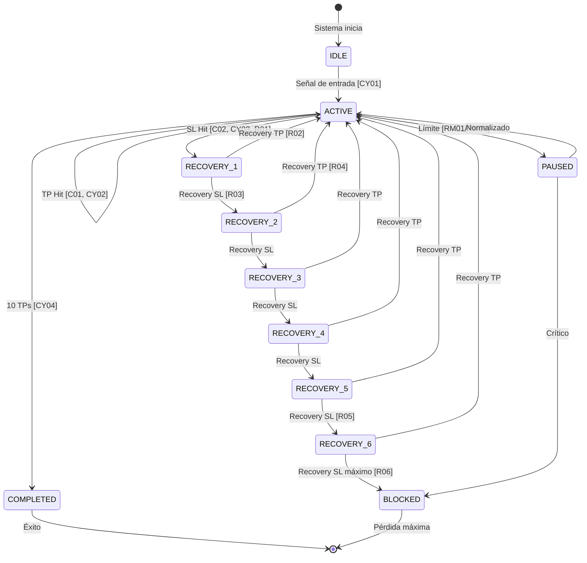
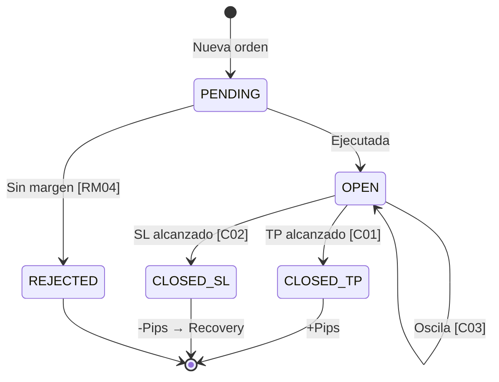
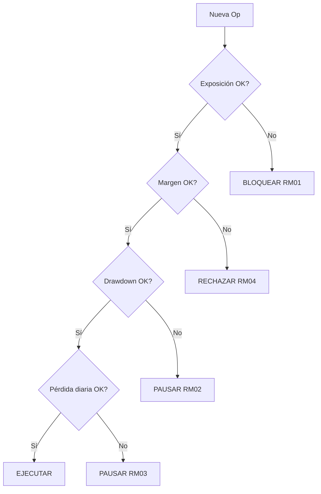

# Estrategia de Testing

## Filosofía

El sistema de testing usa **datos sintéticos en CSV** para simular escenarios de mercado sin depender de MT5. Cada CSV representa un "caso de prueba" que documenta el comportamiento esperado del sistema.

---

## Matriz Completa de Escenarios

### Nivel 1: Core (Operaciones Individuales)

| ID  | Escenario                     | Acción Esperada                    | Prioridad |
| --- | ----------------------------- | ---------------------------------- | --------- |
| C01 | Precio sube 10 pips           | TP ejecutado, beneficio registrado | 🔴 Crítico |
| C02 | Precio baja 50 pips           | SL ejecutado, pérdida registrada   | 🔴 Crítico |
| C03 | Precio oscila sin tocar TP/SL | Operación permanece abierta        | 🔴 Crítico |
| C04 | Gap de precio atraviesa TP    | TP ejecutado al precio de gap      | 🟡 Alto    |
| C05 | Gap de precio atraviesa SL    | SL ejecutado al precio de gap      | 🟡 Alto    |

### Nivel 2: Ciclos

| ID   | Escenario                    | Acción Esperada                  | Prioridad |
| ---- | ---------------------------- | -------------------------------- | --------- |
| CY01 | Nuevo ciclo se abre          | Operación MAIN_BUY/SELL creada   | 🔴 Crítico |
| CY02 | TP alcanzado en ciclo activo | Ciclo permanece activo, nueva op | 🔴 Crítico |
| CY03 | SL alcanzado en ciclo activo | Ciclo pasa a estado RECOVERY     | 🔴 Crítico |
| CY04 | Ciclo completa 10 TPs        | Ciclo se cierra exitosamente     | 🟡 Alto    |
| CY05 | Múltiples ciclos simultáneos | Cada ciclo opera independiente   | 🟡 Alto    |

### Nivel 3: Recovery

| ID  | Escenario                      | Acción Esperada                    | Prioridad |
| --- | ------------------------------ | ---------------------------------- | --------- |
| R01 | SL Main → Recovery N1 activa   | Operación Recovery nivel 1 abierta | 🔴 Crítico |
| R02 | Recovery N1 alcanza TP         | Pips bloqueados se recuperan       | 🔴 Crítico |
| R03 | Recovery N1 falla (SL)         | Recovery N2 se activa              | 🔴 Crítico |
| R04 | Recovery N2 alcanza TP         | Pips N1 + N2 recuperados           | 🟡 Alto    |
| R05 | Recovery llega a N6 (máximo)   | Sistema bloquea más recovery       | 🟡 Alto    |
| R06 | Recovery N6 falla              | Ciclo pasa a BLOCKED               | 🟡 Alto    |
| R07 | Múltiples recovery simultáneas | Cada una se gestiona independiente | 🟢 Medio   |

### Nivel 4: Risk Management

| ID   | Escenario                      | Acción Esperada            | Prioridad |
| ---- | ------------------------------ | -------------------------- | --------- |
| RM01 | Exposición alcanza límite      | Nuevos ciclos bloqueados   | 🔴 Crítico |
| RM02 | Drawdown alcanza límite        | Sistema pausa operaciones  | 🔴 Crítico |
| RM03 | Pérdida diaria alcanza límite  | Sistema pausa hasta mañana | 🟡 Alto    |
| RM04 | Margen insuficiente            | Operación rechazada        | 🟡 Alto    |
| RM05 | Recovery incrementa exposición | Validación de límites      | 🟡 Alto    |

### Nivel 5: Edge Cases

| ID  | Escenario                         | Acción Esperada                  | Prioridad |
| --- | --------------------------------- | -------------------------------- | --------- |
| E01 | Mercado lateral prolongado        | Múltiples TPs pequeños           | 🟢 Medio   |
| E02 | Movimiento unidireccional fuerte  | Recovery múltiples niveles       | 🟢 Medio   |
| E03 | Spread se amplía drásticamente    | Operaciones no abren             | 🟢 Medio   |
| E04 | Conexión perdida durante op       | Estado se recupera al reconectar | 🟢 Medio   |
| E05 | Operación modificada externamente | Sistema detecta inconsistencia   | 🟢 Medio   |
| E06 | Rollover/swap aplicado            | P&L se ajusta correctamente      | 🟢 Bajo    |

### Nivel 6: Multi-Par

| ID   | Escenario                   | Acción Esperada               | Prioridad |
| ---- | --------------------------- | ----------------------------- | --------- |
| MP01 | EURUSD y GBPUSD simultáneos | Ciclos independientes         | 🟡 Alto    |
| MP02 | Correlación: ambos en SL    | Dos recovery activas          | 🟡 Alto    |
| MP03 | Par JPY (2 decimales vs 4)  | Cálculo de pips correcto      | 🟡 Alto    |
| MP04 | Exposición total multi-par  | Suma de exposiciones validada | 🟡 Alto    |

---

## Detalle de Escenarios: Qué Debe Pasar Exactamente

### C01: TP Hit (Precio sube 10 pips)

```
INICIO:
  - Ciclo: ACTIVE
  - Operaciones abiertas: 1 (MAIN_BUY @ 1.10000, TP=1.10100)

TICK: 1.10100 (alcanza TP)

RESULTADO ESPERADO:
  ✓ Op #1 cierra con status=CLOSED_TP
  ✓ Op #1 pnl = +10 pips
  ✓ Ciclo permanece ACTIVE
  ✓ Op #2 se abre (MAIN_BUY @ 1.10100, TP=1.10200)
  ✓ Operaciones abiertas: 1
```

### C02: SL Hit (Precio baja 50 pips)

```
INICIO:
  - Ciclo: ACTIVE
  - Operaciones abiertas: 1 (MAIN_BUY @ 1.10000, SL=1.09500)

TICK: 1.09500 (alcanza SL)

RESULTADO ESPERADO:
  ✓ Op #1 cierra con status=CLOSED_SL
  ✓ Op #1 pnl = -50 pips
  ✓ Ciclo cambia a RECOVERY_1
  ✓ blocked_pips = 50
  ✓ Op RECOVERY_1_BUY se abre (entry offset +20 pips)
  ✓ Operaciones abiertas: 1 (Recovery)
```

### CY03: SL en Ciclo Activo → Recovery

```
INICIO:
  - Ciclo: ACTIVE
  - Total TPs previos: 3
  - Operaciones abiertas: 1 (MAIN_BUY #4)

TICK: SL alcanzado

RESULTADO ESPERADO:
  ✓ Op MAIN_BUY #4 cierra
  ✓ Ciclo.state = RECOVERY_1
  ✓ Ciclo.recovery_state.level = 1
  ✓ Ciclo.recovery_state.blocked_pips = 50
  ✓ Ciclo.recovery_state.recovered_pips = 0
  ✓ Op RECOVERY_1 se abre
  ✓ Las 3 TPs previas NO se afectan (P&L histórico intacto)
```

### R02: Recovery N1 Exitosa

```
INICIO:
  - Ciclo: RECOVERY_1
  - blocked_pips: 50
  - Operaciones abiertas: 1 (RECOVERY_1_BUY @ 1.09520, TP=1.10320)

TICK: 1.10320 (TP Recovery)

RESULTADO ESPERADO:
  ✓ Op RECOVERY_1 cierra con status=CLOSED_TP
  ✓ Op RECOVERY_1 pnl = +80 pips
  ✓ Deuda cubierta: 50 pips bloqueados + 30 pips beneficio
  ✓ Ciclo vuelve a ACTIVE
  ✓ Ciclo.recovery_state = None (limpio)
  ✓ Nueva op MAIN_BUY se abre
```

### R03: Recovery N1 Falla → N2

```
INICIO:
  - Ciclo: RECOVERY_1
  - blocked_pips: 50
  - Operaciones abiertas: 1 (RECOVERY_1_BUY, SL a 50 pips)

TICK: SL alcanzado

RESULTADO ESPERADO:
  ✓ Op RECOVERY_1 cierra con status=CLOSED_SL
  ✓ Ciclo cambia a RECOVERY_2
  ✓ blocked_pips = 50 + 50 = 100
  ✓ Ciclo.recovery_state.level = 2
  ✓ Op RECOVERY_2_BUY se abre (lote mayor)
  ✓ Operaciones cerradas totales: 2 (Main + R1)
```

### R06: Recovery N6 Falla → BLOCKED

```
INICIO:
  - Ciclo: RECOVERY_6
  - blocked_pips: 300 (acumulado)
  - Operaciones abiertas: 1 (RECOVERY_6, lote grande)

TICK: SL alcanzado

RESULTADO ESPERADO:
  ✓ Op RECOVERY_6 cierra con status=CLOSED_SL
  ✓ Ciclo cambia a BLOCKED
  ✓ NO se abre Recovery N7
  ✓ Operaciones abiertas: 0
  ✓ Ciclo marcado como pérdida total
  ✓ blocked_pips registrados como pérdida definitiva
```

### RM01: Límite de Exposición

```
INICIO:
  - Exposición actual: 4.9 lotes
  - Límite: 5.0 lotes
  - Ciclo EURUSD intenta abrir op de 0.2 lotes

RESULTADO ESPERADO:
  ✓ Operación RECHAZADA
  ✓ Ciclo permanece en estado actual (no cambia)
  ✓ Log: "Exposición excedería límite"
  ✓ Evento: OPERATION_REJECTED con reason=EXPOSURE_LIMIT
```

### RM02: Límite de Drawdown

```
INICIO:
  - Balance inicial: 10,000
  - Equity actual: 8,900 (11% DD)
  - Límite DD: 10%

RESULTADO ESPERADO:
  ✓ Sistema entra en PAUSED
  ✓ Todas las operaciones permanecen (no se cierran)
  ✓ No se abren nuevas operaciones
  ✓ Log: "Drawdown excede límite, sistema pausado"
  ✓ Dashboard muestra alerta
```

---

## Mapeo de Escenarios a Código

Cada escenario está vinculado al archivo y función específica donde ocurre la lógica:

### Entrada de Datos (Tick Processing)

| Punto          | Archivo                                                                                                                  | Función                  | Línea |
| -------------- | ------------------------------------------------------------------------------------------------------------------------ | ------------------------ | ----- |
| Obtener tick   | [cycle_orchestrator.py](file:///c:/Users/Artur/wsplumber/src/wsplumber/application/use_cases/cycle_orchestrator.py#L97)  | `_process_tick_for_pair` | 97    |
| Procesar señal | [cycle_orchestrator.py](file:///c:/Users/Artur/wsplumber/src/wsplumber/application/use_cases/cycle_orchestrator.py#L104) | `strategy.process_tick`  | 104   |

### Detección de Cierre (TP/SL Hit)

| Punto                  | Archivo                                                                                                                  | Función                    | Línea |
| ---------------------- | ------------------------------------------------------------------------------------------------------------------------ | -------------------------- | ----- |
| Sincronizar posiciones | [cycle_orchestrator.py](file:///c:/Users/Artur/wsplumber/src/wsplumber/application/use_cases/cycle_orchestrator.py#L128) | `_check_operations_status` | 128   |
| Detectar TP            | [cycle_orchestrator.py](file:///c:/Users/Artur/wsplumber/src/wsplumber/application/use_cases/cycle_orchestrator.py#L148) | `op.status == TP_HIT`      | 148   |
| Notificar estrategia   | [cycle_orchestrator.py](file:///c:/Users/Artur/wsplumber/src/wsplumber/application/use_cases/cycle_orchestrator.py#L151) | `strategy.process_tp_hit`  | 151   |

### Gestión de Ciclos

| Escenario           | Archivo                                                                                                                  | Función                   | Línea |
| ------------------- | ------------------------------------------------------------------------------------------------------------------------ | ------------------------- | ----- |
| CY01: Abrir ciclo   | [cycle_orchestrator.py](file:///c:/Users/Artur/wsplumber/src/wsplumber/application/use_cases/cycle_orchestrator.py#L175) | `_open_new_cycle`         | 175   |
| CY02: Renovar ciclo | [cycle_orchestrator.py](file:///c:/Users/Artur/wsplumber/src/wsplumber/application/use_cases/cycle_orchestrator.py#L281) | `_renew_cycle`            | 281   |
| CY03: Cerrar ciclo  | [cycle_orchestrator.py](file:///c:/Users/Artur/wsplumber/src/wsplumber/application/use_cases/cycle_orchestrator.py#L255) | `_close_cycle_operations` | 255   |

### Recovery

| Escenario                | Archivo                                                                                                                  | Función                 | Línea |
| ------------------------ | ------------------------------------------------------------------------------------------------------------------------ | ----------------------- | ----- |
| R01: Abrir Recovery      | [cycle_orchestrator.py](file:///c:/Users/Artur/wsplumber/src/wsplumber/application/use_cases/cycle_orchestrator.py#L298) | `_open_recovery_cycle`  | 298   |
| R02: TP Recovery         | [cycle_orchestrator.py](file:///c:/Users/Artur/wsplumber/src/wsplumber/application/use_cases/cycle_orchestrator.py#L400) | `_handle_recovery_tp`   | 400   |
| R03: FIFO neutralización | [cycle_orchestrator.py](file:///c:/Users/Artur/wsplumber/src/wsplumber/application/use_cases/cycle_orchestrator.py#L419) | `close_oldest_recovery` | 419   |

### Risk Management

| Escenario               | Archivo                                                                                          | Función                | Línea |
| ----------------------- | ------------------------------------------------------------------------------------------------ | ---------------------- | ----- |
| RM01: Límite exposición | [risk_manager.py](file:///c:/Users/Artur/wsplumber/src/wsplumber/core/risk/risk_manager.py#L53)  | `can_open_position`    | 53-56 |
| RM02: Límite recovery   | [risk_manager.py](file:///c:/Users/Artur/wsplumber/src/wsplumber/core/risk/risk_manager.py#L60)  | `can_open_position`    | 60-63 |
| RM03: Emergency stop    | [risk_manager.py](file:///c:/Users/Artur/wsplumber/src/wsplumber/core/risk/risk_manager.py#L102) | `check_emergency_stop` | 102   |

### Validación antes de Abrir

| Punto              | Archivo                                                                                                                  | Línea   | Descripción                       |
| ------------------ | ------------------------------------------------------------------------------------------------------------------------ | ------- | --------------------------------- |
| Validar exposición | [cycle_orchestrator.py](file:///c:/Users/Artur/wsplumber/src/wsplumber/application/use_cases/cycle_orchestrator.py#L185) | 185-192 | `risk_manager.can_open_position`  |
| Calcular lote      | [cycle_orchestrator.py](file:///c:/Users/Artur/wsplumber/src/wsplumber/application/use_cases/cycle_orchestrator.py#L195) | 195     | `risk_manager.calculate_lot_size` |

---

## Archivos CSV por Escenario

```
tests/scenarios/
├── core/
│   ├── c01_tp_hit.csv
│   ├── c02_sl_hit.csv
│   └── c03_oscillation.csv
├── cycles/
│   ├── cy01_new_cycle.csv
│   ├── cy02_tp_in_cycle.csv
│   └── cy03_sl_triggers_recovery.csv
├── recovery/
│   ├── r01_recovery_n1_start.csv
│   ├── r02_recovery_n1_success.csv
│   ├── r03_recovery_n1_fail_n2_start.csv
│   └── r05_recovery_max_level.csv
├── risk/
│   ├── rm01_exposure_limit.csv
│   └── rm02_drawdown_limit.csv
└── edge/
    ├── e01_lateral_market.csv
    └── e02_strong_trend.csv
```

---

## Formato CSV Estándar

```csv
timestamp,pair,bid,ask,expected_event,expected_state
2024-01-01 10:00:00.000,EURUSD,1.10000,1.10020,CYCLE_OPEN,ACTIVE
2024-01-01 10:00:01.000,EURUSD,1.10005,1.10025,,
2024-01-01 10:00:02.000,EURUSD,1.10010,1.10030,TP_HIT,ACTIVE
2024-01-01 10:00:03.000,EURUSD,1.10015,1.10035,OP_OPEN,ACTIVE
```

Columnas:
- `timestamp`: Momento del tick (milisegundos)
- `pair`: Par de divisas
- `bid`, `ask`: Precios
- `expected_event`: Evento que DEBE ocurrir (validación)
- `expected_state`: Estado del ciclo después del tick

---

## Justificación

### ¿Por qué CSV sintéticos?

1. **Reproducibilidad**: Mismo CSV = mismo resultado siempre
2. **Documentación viva**: Los CSVs documentan casos de uso válidos
3. **Sin dependencias**: No necesita MT5 ni conexión a internet
4. **CI/CD friendly**: Ejecutable en GitHub Actions / pipelines
5. **Debugging**: Fácil inspeccionar qué tick causó un fallo

### ¿Por qué esta jerarquía?

- **Core primero**: Si falla el cálculo de TP/SL, todo falla
- **Ciclos después**: Dependen de que las operaciones funcionen
- **Recovery después**: Depende de que los ciclos funcionen
- **Risk al final**: Se superpone a todo lo anterior

---

## Cobertura Mínima para Release

| Nivel     | Tests Requeridos | % Cobertura |
| --------- | ---------------- | ----------- |
| Core      | C01-C03          | 100%        |
| Ciclos    | CY01-CY03        | 100%        |
| Recovery  | R01-R03          | 100%        |
| Risk      | RM01-RM02        | 100%        |
| Edge      | Opcional         | 50%         |
| Multi-Par | MP03             | 100% (JPY)  |

---

## Grafo de Estados del Sistema

### Estado del Ciclo (Cycle State Machine)



### Estado de Operación Individual



### Flujo de Validación Risk Management



---

## Verificación de Grafo Cerrado

✅ **Todos los estados tienen entrada:**
- IDLE: Estado inicial
- ACTIVE: Desde IDLE, RECOVERY_N, PAUSED
- RECOVERY_1-6: Desde ACTIVE o RECOVERY_{N-1}
- PAUSED: Desde ACTIVE, RECOVERY_N
- COMPLETED/BLOCKED: Estados finales

✅ **Todos los estados tienen salida:**
- Cada estado conecta a al menos otro estado
- COMPLETED y BLOCKED son estados terminales válidos

✅ **No hay estados huérfanos.**

---

## Prioridad de Implementación

```
Fase 1: CORE ──────────▶ C01, C02, C03
         │
         ▼
Fase 2: CICLOS ────────▶ CY01, CY02, CY03
         │
         ▼
Fase 3: RECOVERY ──────▶ R01, R02, R03
         │
         ▼
Fase 4: RISK ──────────▶ RM01, RM02
```

