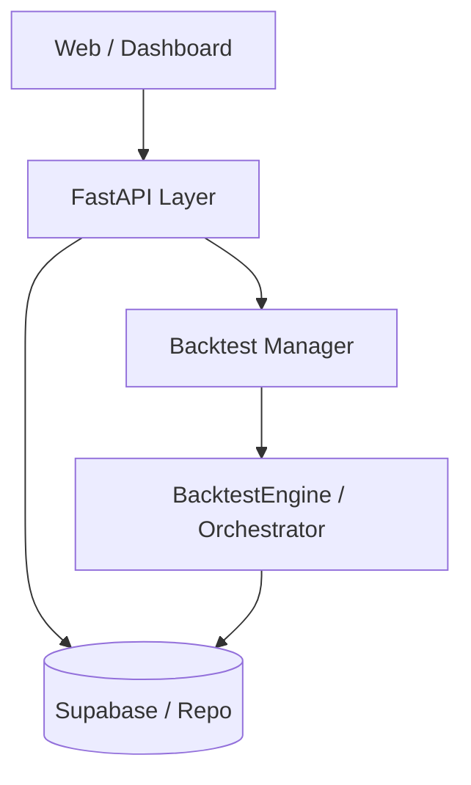

# API & Deployment Layer Implementation Plan

We will implement a management layer using **FastAPI** to allow running, monitoring, and analyzing backtests via a web interface or external dashboard. Finally, we will prepare the system for deployment on **Render**.

## Guarantee: Zero-Impact on Core

This implementation will follow a **Wrapper Pattern**. We will NOT modify any file inside `src/wsplumber/domain` or `src/wsplumber/core`. The API will simply:
1.  **Import** the existing `BacktestEngine`.
2.  **Instantiate** it within a FastAPI background task.
3.  **Read** the results from the `InMemoryRepository` or the generated files.

### Incremental Rollout Strategy
- **Step 1 (Health Only)**: Create the base FastAPI app with just a `/health` endpoint to verify the Render deployment works.
- **Step 2 (Read-only)**: Add endpoints to list existing audit reports from the filesystem.
- **Step 3 (Backtest Trigger)**: Add the `POST /backtest/run` endpoint using a separate background worker.

## Proposed Architecture

We will follow a modular structure within `src/wsplumber/infrastructure/api`.

## Proposed Changes

### 1. API Core Structure [NEW]

#### [NEW] [app.py](file:///c:/Users/Artur/wsplumber/src/wsplumber/infrastructure/api/app.py)
Main entry point for the FastAPI application.
- Configures middleware (CORS).
- Includes routers for different modules.
- Global exception handling.

#### [NEW] [backtest_routes.py](file:///c:/Users/Artur/wsplumber/src/wsplumber/infrastructure/api/routes/backtest.py)
- `POST /backtest/run`: Starts a backtest in a background task. Returns a `task_id`.
- `GET /backtest/{task_id}/status`: Current progress (ticks processed, balance).
- `GET /backtest/{task_id}/report`: Final audit report and chart link.

#### [NEW] [monitoring_routes.py](file:///c:/Users/Artur/wsplumber/src/wsplumber/infrastructure/api/routes/monitoring.py)
- `GET /health`: Basic system health.
- `WS /live`: WebSocket for real-time tick-by-tick monitoring if a simulation is running.

### 2. Deployment [NEW]

#### [NEW] [Dockerfile](file:///c:/Users/Artur/wsplumber/Dockerfile)
Multi-stage build optimized for Python:
- Installs production dependencies.
- Copies the `src` and essential `scripts`.
- Uses `uvicorn` as the server.

#### [NEW] [render.yaml](file:///c:/Users/Artur/wsplumber/render.yaml)
Blueprint for Render to automate deployment:
- Defines a `web` service.
- Sets environment variables (`PYTHONPATH`, etc.).
- Configures health check path.

## Verification Plan

### Automated Tests
- `pytest tests/test_api`: Mocking the orchestrator to verify endpoint responses.
- `httpx` tests for asynchronous background task lifecycle.

### Manual Verification
- Run `uvicorn src.wsplumber.infrastructure.api.app:app` locally.
- Use Swagger UI (`/docs`) to trigger a 10,000 tick backtest.
- Verify that the background task completes and saves the result file.

### Deployment Test
- Verify `Dockerfile` locally with `docker build`.

> [!IMPORTANT]
> Since backtests are CPU-intensive, we will implement a "Simple Pool" so only one backtest runs at a time in the background, preventing server crashes on Render's free/low-tier instances.
